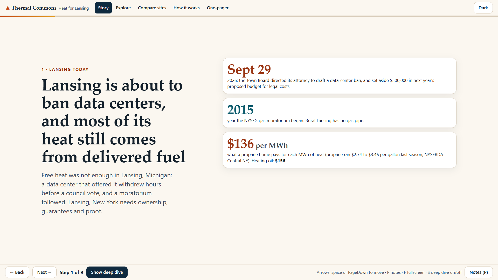
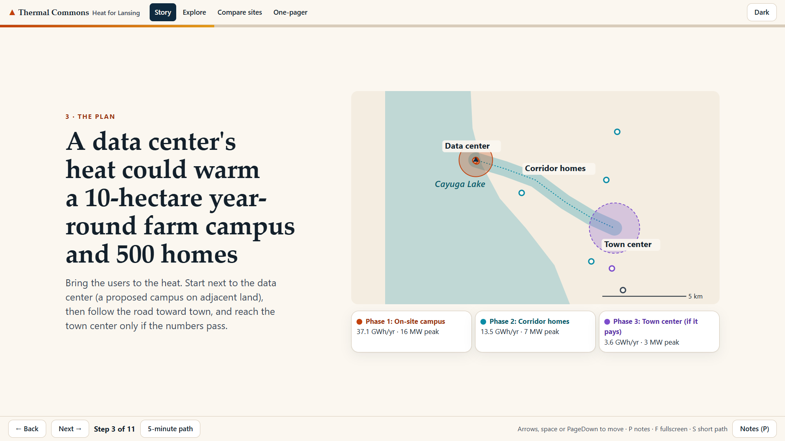
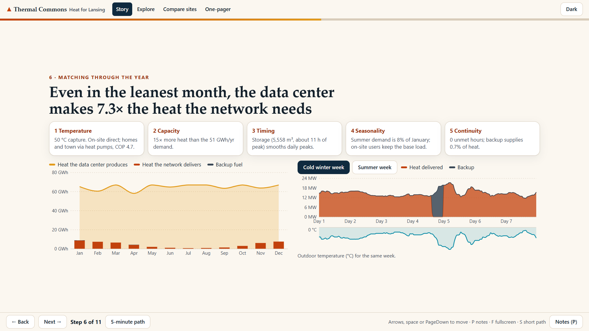
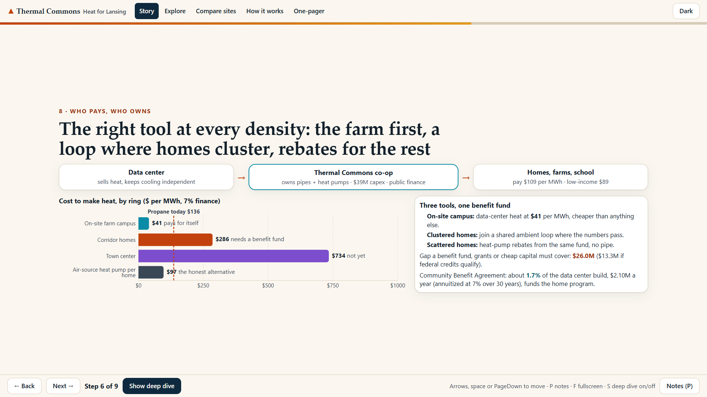
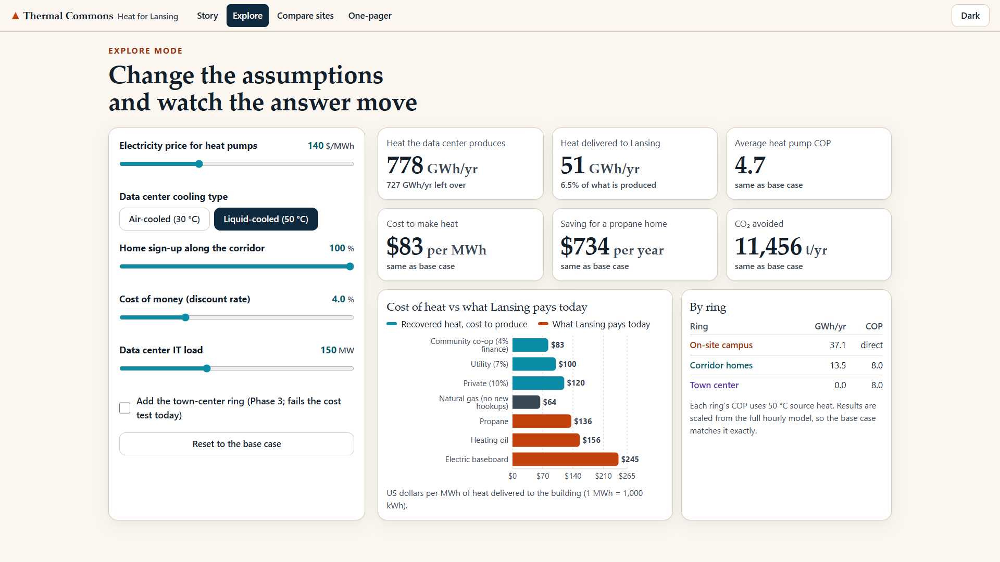
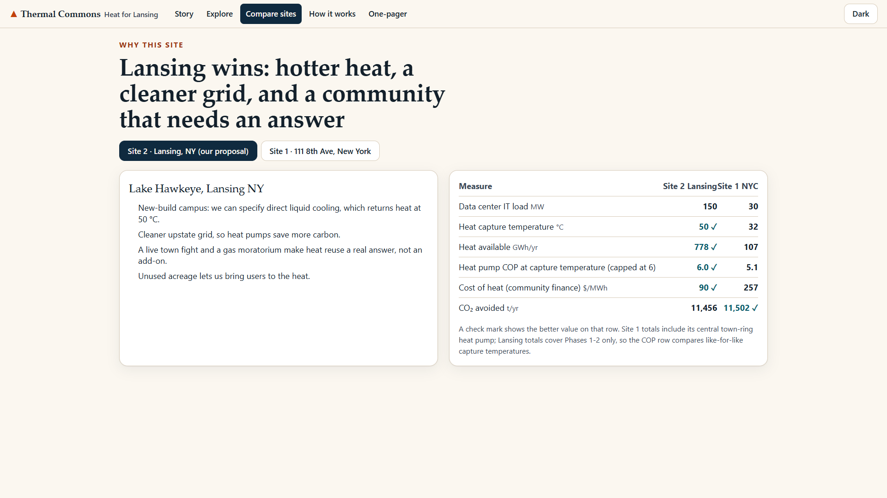

[](https://github.com/harshagarwalnyu/Data-Center-Heat-Reuse/actions/workflows/ci.yml)

# Thermal Commons: Heat for Lansing

HDR x Grundfos "Data Center Heat Reuse" challenge, BAC x iMasons hackathon 2026. Track: Waste Heat Reusage.
Site 2: Lake Hawkeye (TeraWulf) at the former Cayuga coal plant, Lansing, NY. Site 1 (111 8th Ave, New York City) is a comparison toggle in the app.

**Team Thermal Commons:** Harsh Agarwal, Linson Lee, Philip Matchev.

## The idea

Lansing's Town Board has directed its attorney to draft a data-center ban, and the town has had a NYSEG moratorium on new gas connections since 2015 (2026 status unverified). We do not pitch heat reuse as a sustainability add-on. We pitch it as **the conditions under which Lansing could say yes**: a binding Community Benefit Agreement and Heat Supply Agreement that put data-center heat to work for the town through a **community thermal co-op** (member-owned, cost-based pricing, a Town seat on the board), with public metering and a cooling-always-wins clause so heat reuse can never put the data center at risk.

The engineering follows from the demand side. Heat is oversupplied by about 15 times, so the question is not how much heat but where it can reach cheaply. That gives **the right tool at every density**: direct heat exchange for a farm campus at the fence, an ambient loop with building heat pumps where homes cluster, heat-pump rebates where they do not, and a town-center main only if a much larger anchor load appears. We also say plainly what the model shows: the on-site campus pays for itself, the corridor does not, and the honest answer for the corridor is a funding answer, quantified below.

Everything is computed by an hour-by-hour (8,760 h) model on real Ithaca weather and rendered in a static web app that reads the model's JSON, so every number on screen can be traced to a file and a formula.

## Headline numbers

Base case, Site 2, phases 1-2 (on-site campus plus 500 corridor homes). Values are from `outputs/site2.json` as generated 2026-10-04; the linked document derives each one. If the model is rerun, the JSON is the source of truth.

| Metric | Value | Unit | Derived in |
|---|---|---|---|
| Heat available at the capture point | 777.6 | GWh/yr | [methodology: supply](docs/methodology.md#2-supply-heat-available-at-the-capture-point) |
| Heat delivered to customers | 50,576 | MWh/yr (6.5% of available) | [results](docs/results.md#base-case-headline-numbers-outputssite2json) |
| LCOH, on-site campus ring | 40.6 | USD/MWh at 7% | [methodology: finance](docs/methodology.md#6-finance) |
| LCOH, corridor ring | 285.8 | USD/MWh at 7% | [results: ring by ring](docs/results.md#ring-by-ring) |
| LCOH, blended phases 1-2 (4% / 7% / 10%) | 89.5 / 106.1 / 124.6 | USD/MWh | [methodology: LCOH](docs/methodology.md#levelized-cost-of-heat) |
| Propane / heating oil, same basis | 136.1 / 155.8 | USD/MWh | [assumptions: finance](docs/assumptions.md#finance-configfinanceyaml) |
| Tariff (0.8 x propane equivalent) | 108.9 | USD/MWh | [methodology: tariff rule](docs/methodology.md#tariff-rule) |
| Household savings vs propane (27 MWh/yr home) | 735 | USD/yr | [results](docs/results.md#base-case-headline-numbers-outputssite2json) |
| Capex | 38.76 | million USD | [methodology: capex](docs/methodology.md#capex-financepycapex_lines) |
| Whole-project funding gap (7%, 30 yr, PV) | 26.0 | million USD, about 2.1 million USD/yr annuitized | [results: funding answer](docs/results.md#the-funding-answer) |
| Gap as share of data-center capex benchmark | 1.73 | % of 1.5 billion USD | [results: funding answer](docs/results.md#the-funding-answer) |
| CO2 avoided | 11,408 | t CO2/yr | [methodology: impact](docs/methodology.md#7-impact) |
| Energy reuse factor (ERF) | 0.046 | ratio | [methodology: impact](docs/methodology.md#7-impact) |
| Average heat-pump COP | 4.71 | dimensionless, clipped to [2, 6] | [methodology: COP](docs/methodology.md#4-heat-pump-cop) |
| Unmet hours | 0 | h/yr (backup sized at 100% of peak) | [methodology: dispatch](docs/methodology.md#5-storage-and-dispatch) |

Why the corridor needs funding, and what closes it: [docs/results.md](docs/results.md). Inputs and how much we trust each: [docs/assumptions.md](docs/assumptions.md).

## The app

| Story mode, step 1: Lansing today | Step 3: the plan, three rings |
|---|---|
|  |  |

| Step 6: matching supply and demand through the year | Step 8: who pays, who owns |
|---|---|
|  |  |

| Explore: sliders recompute in the browser | Compare: Site 2 vs Site 1 |
|---|---|
|  |  |

Screenshots were regenerated with the v3.1 model numbers; the running app and `outputs/` remain authoritative. Routes: `/` story (11 steps, presenter notes, 5-minute path), `/explore/`, `/compare/`, `/how/` (methods and sources), `/print/` (one-pager with QR). Full-resolution 1366 and 1920 captures of every screen are in [web/screenshots/](web/screenshots/).

## Quickstart

### See the app (under 2 minutes)

Prerequisite: [Bun](https://bun.sh). The model outputs are already committed in `web/public/data/`, so no Python is needed.

```bash
cd web
bun install
bun run dev
```

Open http://localhost:3000. Use the arrow keys in story mode, `P` for presenter notes, `S` for the 5-minute path.

For a static build: `bun run build`, then `node scripts/serve.mjs` serves `web/out/` on http://localhost:4173.

### Rerun the full model

Prerequisite: [uv](https://docs.astral.sh/uv/) and Python 3.11 or newer.

```bash
uv sync
uv run python -m heatreuse.run             # model -> outputs/site2.json, site1.json, offtakers.json, charts/
uv run python -m heatreuse.verify          # self-check + input register (run before the export)
uv run python scripts/export_web_data.py   # copy outputs into web/public/data/
uv run pytest                              # 8,760-hour balance, COP, LCOH hand checks, JSON contract tests
uv run python -m heatreuse.analysis        # Monte Carlo + monthly/ring/load-duration detail -> outputs/analysis_detail.json
uv run python -m heatreuse.hydraulics      # pump/pipe screening -> outputs/hydraulics.json
```

One command for the whole chain (model, verify, analysis, hydraulics, web export; stops on any verify FAIL): `uv run python -m heatreuse` (add `--no-export` to leave `web/public/data/` untouched).

The model reads cached Ithaca and Central Park TMYx weather from `data/processed/`, so it runs offline. The raw EPW files are only needed to rebuild that cache. Refresh the app after a rerun by reloading the page: it fetches the JSON at runtime. Details: [docs/architecture.md](docs/architecture.md).

## How it works, in four lines

1. Weather (TMYx, 8,760 h) drives heating demand for three rings: on-site campus, corridor homes, town center.
2. Supply is IT load x capture fraction x availability from a sidestream heat exchanger; dry coolers stay the primary rejection path.
3. An hourly dispatch uses direct exchange, then a source-side hot-water tank, then backup boilers; heat pumps use COP = clip(0.5 x T_sink_K / (T_sink_K - T_source_K + 2 x 3 K approach), 2, 6), i.e. 0.5 x Carnot with a 3 K approach per exchanger.
4. Finance annualizes capex by asset life with the capital recovery factor, reports LCOH at 4, 7 and 10 percent, applies a 0.8 x propane tariff rule, and computes the funding gap; impact reports CO2 and ERF/ERE.

Full pipeline with formulas and code references: [docs/methodology.md](docs/methodology.md).

## Repository map

| Path | Contents |
|---|---|
| `src/heatreuse/` | The model: weather, supply, demand, heat pump, dispatch, finance, impact, scoring, report, CLI. |
| `config/` | All inputs as YAML (engineering, finance, impact, offtakers, Site 1 overrides). Every value is sourced or tagged as an assumption. |
| `tests/` | `test_model.py`: 17 tests (energy balance, COP, LCOH, contract). |
| `outputs/` | Model outputs: `site2.json`, `site1.json`, `offtakers.json`, `charts/`. |
| `scripts/` | `export_web_data.py` (outputs to web), `extract_resources.py` (organizer documents to text). |
| `web/` | Next.js static app: `app/` routes, `components/`, `lib/` (formulas for Explore), `public/data/` (JSON), `screenshots/`. |
| `data/processed/` | Cached hourly weather and offtaker table. |
| `docs/` | Proposal and design documents, audits. Index: [docs/README.md](docs/README.md). Draft CBA and heat supply term sheet: [docs/term-sheet.md](docs/term-sheet.md). |
| `research/` | Fact base, verification, model notes, case studies, organizer digest. |
| `resources/` | Organizer materials as extracted text and pages. |
| `PLAN.md` | Original working plan. |

## Judging rubric mapping

The official rubric is in [docs/rubric.md](docs/rubric.md). Each category is scored 1 to 4.

| Category | What a judge can check | Where |
|---|---|---|
| Technology | 8,760-hour dispatch on real weather, Carnot-bounded COP, storage state of charge, CRF/LCOH by asset life, tornado and scenarios, 17 passing tests, JSON contract between model and app, in-browser recompute in Explore | [methodology](docs/methodology.md), [architecture](docs/architecture.md), `tests/`, `/how/` |
| Presentation | 11-step story with presenter notes, one-pager with QR, video script, every headline traced to a method and source | [results](docs/results.md), [video script](docs/video-script.md), `/` and `/print/` |
| Innovation | "The conditions under which Lansing could say yes": binding CBA and Heat Supply Agreement, a community thermal co-op as owner, public metering; right tool at every density; honest funding gap instead of a pooled average | [ownership-deal](docs/ownership-deal.md), [results](docs/results.md), [risk-matrix](docs/risk-matrix.md) |
| Execution | Tests pass, build is static, works at 1366 and 1920 widths, independent number and UX audits with findings fed back | [docs/audit/](docs/audit/), [frontend-notes](docs/frontend-notes.md), [web/screenshots/](web/screenshots/) |
| Theme | Waste heat becomes community value: a 10-hectare year-round farm, 500 homes, jobs, local food, CO2; HDR regenerative scorecard | [regenerative scorecard](docs/proposal/13-regenerative-scorecard.md), [greenhouse-anchor](docs/greenhouse-anchor.md), [stakeholders](docs/stakeholders.md) |

## Honest limits

The corridor ring is uneconomic stand-alone, and an air-source heat pump in each home is cheaper than our loop on pure cost. Most unit costs are our own assumptions, no customer has signed, the heat price of zero is a proposed term, and the model uses one typical weather year. All of these, and the order in which we would close them, are in [docs/results.md](docs/results.md) and [docs/assumptions.md](docs/assumptions.md).

## License and sources

The code and original text in this repository are released under the MIT License (see [LICENSE](LICENSE)). Organizer-provided and third-party source documents in `resources/` remain under their owners' terms. External data used by the model (NYSERDA prices, EPA and eGRID emission factors, EIA electricity prices, Climate.OneBuilding weather) is cited with URLs in [docs/assumptions.md](docs/assumptions.md).
