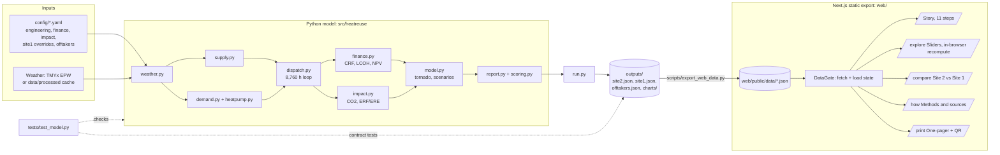

# Architecture

Thermal Commons has three layers: a Python model that computes everything, a JSON contract that is the only interface, and a static Next.js app that renders it. The app never contains a model result; it reads files. That keeps one source of truth and lets the model be rerun and the numbers refreshed without a code change in the web layer.

## Diagram



## Layers

### 1. Model (`src/heatreuse/`)

| Module | Responsibility |
|---|---|
| `config.py` | Loads the three base YAML files and deep-merges `config/site1.yaml` for Site 1. `override()` returns a modified copy, used by the tornado and scenarios. |
| `weather.py` | Hourly dry-bulb temperature (8,760 rows). |
| `supply.py` | Hourly IT load, availability mask, heat available. |
| `demand.py`, `heatpump.py` | Three rings, COP formula, heating curve. |
| `dispatch.py` | Hourly dispatch with a source-side tank and backup. |
| `finance.py` | Capex lines, annualization, LCOH, tariff, incumbents, NPV, DC-exit. |
| `impact.py` | CO2, ERF/ERE, jobs, food. |
| `model.py` | `simulate`, `full`, `tornado`, `scenarios`, `breakeven_homes`, `cop_compare`. |
| `scoring.py` | Offtaker ranking. |
| `report.py` | Builds the JSON documents (rounding, labels, provenance, sources). |
| `charts.py` | Static PNG charts into `outputs/charts/`. |
| `run.py` | CLI entry point. |

Method details are in [methodology.md](methodology.md).

### 2. JSON contract

The model writes `outputs/site2.json`, `outputs/site1.json`, `outputs/offtakers.json`. `scripts/export_web_data.py` copies them to `web/public/data/`. The shape is specified in [data-contract.md](data-contract.md) and enforced by three contract tests (`test_json_contract_site2`, `test_json_contract_site1`, `test_json_contract_offtakers`) plus `test_site2_v2_additions`.

Design properties of the contract:

- Every figure the UI shows is a field in the JSON, so a number on screen can be traced to `outputs/site2.json` and from there to a config key.
- Optional blocks under `extras` carry scenario and funding detail (ring LCOH, CBA, with-town case, tariff scenarios, provenance). The `provenance` block names the unit and source of the headline fields, and `sources` lists the references the app's sources panel links to.
- The hourly arrays are sampled for charts only: two 168-hour weeks (`weeks.winter`, `weeks.summer`) and 12 monthly rows. The full 8,760-hour series stays in Python.
- Files may be overwritten after a web build because the app fetches them at runtime.

### 3. Web app (`web/`)

Next.js 16 with React 19, `output: "export"` (static HTML), Tailwind 4, Recharts for charts, MapLibre for the map (tile-free GeoJSON overlay with an inline SVG fallback), Framer Motion for story transitions. Versions are in `web/package.json`.

| Route | Source | Purpose |
|---|---|---|
| `/` | `web/app/page.tsx`, `components/story/` | Story mode, 11 steps, hash deep links, presenter notes, 5-minute path. |
| `/explore/` | `web/app/explore/page.tsx`, `components/Explore.tsx` | Sliders (electricity price, cooling type, corridor sign-up, discount rate, IT load, town ring). Recomputes COP, LCOH and CO2 in the browser with `lib/model.ts`, which re-implements the formulas listed in the contract, and scales the model's headline numbers by scenario over base so that base settings reproduce the model exactly. |
| `/compare/` | `web/app/compare/page.tsx`, `components/Compare.tsx` | Site 2 versus Site 1 toggle with the generated "why not chosen" text. |
| `/how/` | `web/app/how/page.tsx`, `components/HowItWorks.tsx` | "How it works": live COP and LCOH demonstrations, test status, honest limits and the sources list, all driven from the JSON. |
| `/print/` | `web/app/print/page.tsx`, `components/PrintSheet.tsx` | US Letter one-pager with print CSS and a client-generated QR code. |

Everything is a client component behind `DataGate`, which waits for `AppProvider` to fetch the three JSON files (`cache: no-cache`) and shows a loading or error state until they arrive. The only hardcoded numbers in the web layer are model physics for Explore (`lib/model.ts`: eta 0.5, approach 3 K, 30-year life, COP cap) and UI choices. See [frontend-notes.md](frontend-notes.md).

## Data flow, step by step

1. `config/*.yaml` is read by `config.load("site2")` or `config.load("site1")`.
2. `weather.load_temps` returns 8,760 temperatures; `supply` and `demand` build hourly arrays.
3. `dispatch.dispatch` runs the storage and backup loop; `finance.evaluate` and `impact.evaluate` consume its output.
4. `run.py` additionally runs the tornado, scenarios, COP comparison, break-even scan, offtaker scoring and the Site 1 model.
5. `report.py` assembles the documents, and `run.py` writes them with `json.dumps(..., indent=2)`.
6. `export_web_data.py` copies them to `web/public/data/`.
7. `next build` produces `web/out/` (static). The browser fetches `/data/*.json` on load.

## How to regenerate

From the repository root:

```bash
uv sync                                      # create the environment from uv.lock
uv run python -m heatreuse.run               # model -> outputs/site2.json, site1.json, offtakers.json, charts/
uv run python scripts/export_web_data.py     # copy to web/public/data/
uv run pytest                                # 17 model and contract tests
```

Then the web layer:

```bash
cd web
bun install
bun run dev            # development server, http://localhost:3000
bun run test           # vitest on lib/model.ts
bun run build          # static export into web/out/ (prebuild copies the MapLibre worker)
node scripts/serve.mjs # serve web/out on :4173
bun run shots          # Playwright screenshots into web/screenshots/ (needs CHROME path, see frontend-notes.md)
```

Notes:

- The model runs from the cached weather in `data/processed/weather_site2.csv` and `weather_site1.csv`, which are committed. The raw EPW files in `data/raw/` are git-ignored and are only needed to rebuild the cache.
- Outputs are deterministic: the only random element is the seeded outage mask (`outage_seed` in config).
- For a subpath deployment set `NEXT_PUBLIC_BASE_PATH` before `bun run build` (see `web/next.config.mjs`).
- Because the app reads JSON at runtime, re-running the model and `export_web_data.py` refreshes every number without a rebuild of the app code. Pages that quote numbers from `docs/` (including [results.md](results.md)) must be refreshed by hand.

## Why this shape

- **One source of truth.** Computing in Python and rendering from JSON means the headline cannot disagree with the model. The Explore page is the only place the formulas are duplicated, and it is covered by vitest and by the base-case-reproduces-model property.
- **Static export.** No server, no secrets, no database. The app can be hosted on any static host or opened from `web/out`.
- **Contract tests.** A schema change in `report.py` that would break the UI fails `pytest` before it reaches the browser.
