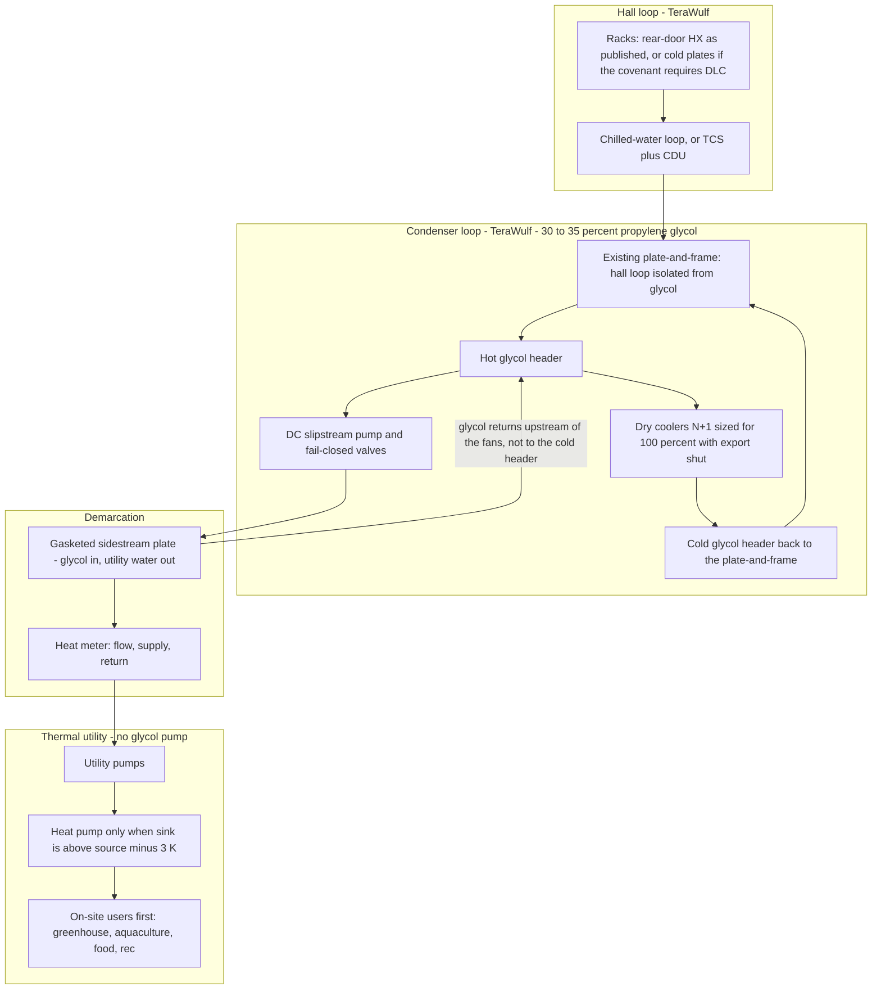

# Cooling integration — Lake Hawkeye (TeraWulf / former Cayuga), Lansing NY

Data-center side of heat capture for the proposed Lake Hawkeye campus. Site 1 (111 8th Ave, NYC) is the comparison only. This note is the cooling interface a town covenant would bind. It is not a claim that heat reuse is already in TeraWulf’s design.

**Model basis used here:** 150 MW phase 1, with a 300–400 MW build-out kept as a scenario. Developer FAQ says full buildout is “up to approximately 300 MW” (https://www.lakehawkeyedata.com/faq, verified 2026-10-03). A December 2025 third-party assessment describes Phase 1 as 138 MW and a 400 MW long-term plan (https://cleancayugalake.org/wp-content/uploads/2025/12/Attachment_C_Independent_Assessment_of_the_Proposed_Cayuga_Data_Campus-_2.pdf, verified 2026-10-03). Those three figures are not the same. This note sizes the *interface*, not the IT load: dry coolers stay able to reject 100% of whatever phase is built.

**Status:** findings below were checked against organizer text and the URLs cited. Items still open are listed under Lane status.

## 1. What this lane covers

Cooling reliability is the constraint. Heat recovery is a sidestream on the rejection loop. Offtakers never become the heat sink.

What is in scope:

- Where heat is captured (condenser glycol today; CDU facility water if the covenant requires direct liquid cooling).
- Temperatures: organizer bands, ASHRAE W-classes, and what NVIDIA GB200/GB300-class hardware has actually published.
- Sidestream plate heat exchanger, dry coolers kept at 100%, control priority, heat meter, ownership line.
- COP screen: 0.5 × Carnot, 3 K approach per heat exchanger, sources 30/40/50/60 °C, sinks 45/70 °C.
- What cooling does in four failures: fouled exchanger, glycol leak, offtaker loss, data-center outage.

What is out of scope: offtaker loads, pipe routes to the town center, tariffs, and carbon totals.

## 2. Organizer source notes (HDR / Grundfos pack)

Organizer text outranks web pages. Read 2026-10-03 from `resources/text/`.

**HDR regenerative frame** (`2026_10_01_Hackathon_NYU_-_Suburban_Site_-_Lake_Hawkeye.txt`). Three lenses — Community, Ecology, Health — and seven domains: human health, community, air, carbon, water, biodiversity, nutrients. The site pack states: “There are also no disadvantaged communities nearby.” Do not score this cooling concept as an equity project for a designated disadvantaged community. The same pack says Cayuga Lake and an inlet are phosphorus-impaired, baseline water stress is low–medium, and air-quality days at nearby monitors were not worse than “Good” on the 5- and 10-year averages it cites. Future heat: “3 degrees hotter by 2050” and “up to 69 days above 90 degrees compared with 19 days today.” The pack does not label °C or °F on those figures.

**HDR cooling components** (`NYU_BAC_Hackathon_HDR_Waste_Heat_Reuse_2026.1002.txt`). High-density plant list includes a cooling distribution unit (CDU), cold plate, dry cooler, and rear-door heat exchanger. Direct-to-chip is described as a closed liquid loop through cold plates, with a CDU between the hall piping and facility rejection.

**Heat Reuse 101** (`20230623_Data_Centers_HeatReuse_101_3.2.docx.txt`, Alfa Laval / Cloud&Heat / NREL, CC BY-SA). Greater use of direct liquid cooling “enables potentially higher return temperatures (45-65 °C vs 27-28 °C).” Figure 3 places air cooling, rear-door heat exchangers, and cold plate / immersion on a rising temperature scale (labels in the extract: 15 °C, 28 °C, 40 °C, 65 °C). The data center “will almost always have a redundant cooling system able to remove the heat if something were to happen to the heat host.” Extraction cost is shared; temperature upgrade, storage, and heat-to-cooling sit with the heat host. Heat reuse can cut chiller and cooling-tower water *where those exist*. Lake Hawkeye’s published sink is air, so that water saving does not transfer one-for-one (section 3).

**Topic 5** (`Topic_5_-_Heat_reuse,_Connecting_DC_to_DE_systems_v5.txt`). Air cooling ~25–35 °C, liquid cooling ~35–60 °C, immersion potentially above 60 °C. Heat moves through a heat exchanger into a secondary circuit; a heat pump upgrades it. The “indirect” configuration keeps the data center and the district system hydraulically separated. Typical COP cited on the slides: 2–5. A UK campus example on the same deck: evaporator 25–16 °C, condenser 60–75 °C, COP about 2.95, supply up to 75 °C. Høje Taastrup: data-center temperatures given as about 30 °C supply / 15 °C return, then a heat pump. 4th-generation district heating on this deck is a 50–60 °C flow temperature.

**Grundfos district-energy application guide, 2018** (`district-energy-application-guide-district-energy-2018-master-en.txt`). An indirect connection uses a heat exchanger so a burst or a pressure change on one side does not pass to the other. Contemporary district-heating examples in the guide are about 75/35 °C, with low-temperature systems at 60/30 °C or 55/25 °C. Brazed plate exchangers: cleaning by flushing only, “max capacity ~ 2 MW.” Gasketed plates: can be opened for cleaning and repair, “max capacity 30-50 MW.” iGRID playbook in the same pack: customers are billed from an energy meter (BTU meter) where the network owner and the building owner differ.

**Site 1 pattern, not a Lake Hawkeye fact** (`June_10th_FPCJ_Meeting_Summary_Compiled.txt`, workshop 2026-06-10). The Jamaica church concept captures heat from Verizon dry-cooler glycol through an intermediary energy transfer station, then heat pumps. Dry coolers stay. That is the same sidestream idea, on a commissioned carrier hotel, at rear-door / glycol temperatures the workshop does not quantify in the extract.

## 3. Lake Hawkeye cooling system as stated

Sources: https://www.lakehawkeyedata.com/closed-loop-cooling and https://www.lakehawkeyedata.com/faq (both verified 2026-10-03). These are the developer’s pages.

| Claim | What the page actually says |
|---|---|
| Loop | “Fully sealed, closed-loop cooling system that continuously recirculates the same fluid without drawing from or discharging to Cayuga Lake.” |
| Rejection | “Air-cooled dry coolers.” Fans reject heat to air. FAQ: “advanced cooling fans with ultra-low-noise operation.” No published sound level in that FAQ answer. |
| Fluid | “Food-grade, non-toxic propylene glycol.” FAQ: “30-35% propylene glycol by weight.” Freeze point of that blend is **[unverified]** (not on the pages read). |
| Hall side | “Chilled water circulates through rear-door heat exchangers attached to server racks.” |
| Isolation already in their plant | “Plate-and-frame heat exchangers isolate the chilled-water loop from a separate condenser loop, which carries the heat to air-cooled dry coolers.” |
| Redundancy | “N+1 redundancy and valved isolation segments.” Maintenance “does not require a data center shutdown.” |
| Fluid life | Renewal every 7–15 years, drained to sealed tanks, licensed hauler. Refill is “new deionized water and food-grade glycol.” |

**Consequence.** The published design is rear-door heat exchangers on chilled water, then a condenser glycol loop to dry coolers. It is not a cold-plate / CDU plant, and it does not publish loop temperatures. Organizer Heat Reuse 101 puts rear-door return heat near the 27–28 °C band and direct liquid cooling at 45–65 °C. Topic 5’s air band is ~25–35 °C and its liquid band is ~35–60 °C. Until TeraWulf publishes a temperature, the conservative capture temperature for *their stated plant* is the 30 °C column in section 7, not 50–60 °C.

**ASSUMPTION.** A binding covenant can require warm-water direct-to-chip (facility water in ASHRAE class W40 or W45) so on-site greenhouses see ~40–50 °C return fluid. That is a condition of approval, not a description of the cooling page as it stands. Reasoning: rear-door chilled water will not clear a 45 °C sink without a heat pump; W40/W45 return fluid will, for low-temperature on-site uses, after one plate approach (section 7).

**Water permit — do not tie it to cooling savings.** NYSDEC water-withdrawal permit 7-5032-00019/00024, issued to Cayuga Operating Company, LLC (the site owner, not TeraWulf), effective 2026-04-13, expires 2031-04-30, authorizes up to 1,008,000 gallons per day (https://dec.ny.gov/sites/default/files/2026-04/cayugaoperatingwwpermit.pdf, verified 2026-10-03). The Ithaca Voice reports that DEC said this renewal “is not associated with” the proposed data center and that it covers current operations (https://ithacavoice.org/2026/04/state-greenlights-water-permit-for-lansing-power-plant-amid-data-center-backlash/, verified 2026-10-03). The PDF text extraction is degraded in the purpose table; do not invent a use list beyond “up to 1,008,000 gpd” and DEC’s statement that it is not the data-center permit. Permit condition 3 requires a new application to transfer the withdrawal system.

Heat reuse does not retire that permit, and it does not “save” 1.008 MGD of lake water. The developer’s heat sink is air. Any lake-water covenant is a separate promise: the data center will not apply to use Cayuga Lake as cooling water. Closed-loop dry cooling is what protects the lake. Heat reuse only reduces fan energy when someone is actually taking heat.

Developer spill statement (FAQ, verified 2026-10-03), presented as SDS summary; the SDS file itself was not opened in this lane: fish LC50 40,613 mg/L; 81–98% degraded in 28 days; log KOW = –1.07. Low aquatic toxicity is not a license to drain glycol toward a phosphorus-impaired lake. Containment stays in the failure table.

Deep Green’s 24 MW heat-reuse project with Board of Water & Light is Lansing, Michigan. It is a precedent only. It is not this site.

## 4. Capture point and temperatures

### 4.1 Two capture points — only one matches the published plant

**Published plant — capture on the condenser glycol, not in the hall.** Hall chilled water through the rear doors is what holds rack inlet temperature. Do not put the export tie-in on that loop. Capture on the condenser loop: 30–35% propylene glycol, downstream of their plate-and-frame, on the hot pipe that feeds the dry coolers. That is the stream the fans would otherwise dump to air.

**Covenant plant — capture on CDU facility water.** If IT is direct-to-chip, the hall loop is a technology cooling system (cold plates, rack manifold, CDU). NVIDIA’s description of the path, written for GB200 NVL72 and GB300 NVL72: heat is captured in the technology cooling loop, “cycled through a coolant distribution unit via liquid-to-liquid heat exchanger, and ultimately transferred to a facility cooling loop” (https://blogs.nvidia.com/blog/blackwell-platform-water-efficiency-liquid-cooling-data-centers-ai-factories/, verified 2026-10-03). The export plate ties into the *facility* return, between the CDU and the dry coolers. The offtaker never shares piping with the cold plates.

DGX GB200 and DGX GB300 racks, in NVIDIA’s own user guide: cold plates on the CPUs and GPUs; “the rest of the components like networking and storage devices are air cooled”; power shelves use air-cooled 5.5 kW supplies; rack power “approximately 120 kW” (https://docs.nvidia.com/dgx/dgxgb200-user-guide/hardware.html, verified 2026-10-03). Liquid capture is not 100% of rack power on that guide. Lenovo’s GB300 NVL72 guide puts the split at about 90% liquid / 10% air, rack TDP 135 kW and up to 155 kW peak (https://lenovopress.lenovo.com/lp2357-lenovo-nvidia-gb300-nvl72-rack-scale-ai, verified 2026-10-03). Use 90% only as that OEM’s reference, not as TeraWulf’s design.

### 4.2 Air vs liquid — organizer bands

| Architecture | Heat quality the organizers state | Source |
|---|---|---|
| Air / legacy return | 27–28 °C in Heat Reuse 101; ~25–35 °C in Topic 5 | organizer text, section 2 |
| Rear-door | Grouped with the lower band in Heat Reuse 101 Figure 3 (28 °C label) | same |
| Cold plate / direct liquid | 45–65 °C vs 27–28 °C (Heat Reuse 101); ~35–60 °C (Topic 5) | same |
| Immersion | Potentially above 60 °C (Topic 5); Figure 3 label 65 °C | same |

ASHRAE air classes are *inlet air to the IT*, not the heat-reuse temperature. Recommended dry-bulb for classes A1–A4 is 18–27 °C. Class H1 (high-density air) recommended 18–22 °C, allowable 15–25 °C. Allowable A1 dry-bulb is 15–32 °C. Source: ASHRAE TC 9.9 reference card for the 2021 thermal guidelines, 5th edition, revised and expanded (https://www.ashrae.org/File%20Library/Technical%20Resources/Bookstore/Supplemental%20Files/Therm-Gdlns-5th-R-E-RefCard.pdf, verified 2026-10-03). The card’s copyright line limits quotation; the numbers here are the class limits, paraphrased.

### 4.3 ASHRAE W-classes (facility water supply)

Same reference card, Table 3.1. Every class has a minimum facility-water supply of 2 °C. The class name is the maximum supply temperature: W17 to 17 °C, W27 to 27 °C, W32 to 32 °C, W40 to 40 °C, W45 to 45 °C, W+ above 45 °C. The card’s class text: W17/W27 are typically chiller and cooling-tower plants, with an optional water-side economizer; W32/W40 are typically run without chillers, though some sites still need them; W45/W+ are typically run without chillers, and “some locations may not be suitable for drycoolers.”

W-class temperatures are the *supply to the IT / CDU*, the cold side. Heat reuse wants the *return*, which is warmer than the supply by the loop rise. A W45 supply does not mean the captured heat is 45 °C. It means the IT will accept supply as warm as 45 °C, so the return can sit above that.

### 4.4 NVIDIA GB200 / GB300-class inlet and outlet

What is published, and what is not:

| Item | Figure | Source | Applies to |
|---|---|---|---|
| Rack inlet, allowable | “as high as 45 °C (113 °F)” for real-world use; operating water 2–50 °C, stated as ASHRAE W45 compliant | Lenovo GB300 NVL72 product guide, URL in §4.1 | Lenovo’s GB300 NVL72 offering, not a TeraWulf submittal |
| Fluids | Deionized water (Lenovo recommends) or PG25 | same | same |
| Flow vs inlet (Lenovo table) | 25 °C → 59 LPM; 30 °C → 71; 35 °C → 89; 40 °C → 119; 45 °C → 177 LPM. Pressure drop rises to 18.4 psi at 45 °C | same, their Table 27 | Rack manifold flow, not facility-loop flow |
| Cold plates | CPUs, GPUs, HBM liquid-cooled; front options, power distribution board, and M.2 air-cooled. NVL switch trays fully liquid-cooled | same | Lenovo GB300 |
| CDU | In-rack or in-row CDU; hoses to CDU inlet and return; liquid-to-liquid handoff implied by the NVIDIA Blackwell blog path in §4.1 | Lenovo guide; NVIDIA Blackwell blog | GB200/GB300 class |
| NVIDIA user-guide outlet temperature | Not stated | DGX GB user guide, URL in §4.1 | — |
| Rubin-generation inlet / outlet | Inlet up to 45 °C; “exits at roughly 55 degrees”; coolant “75% water and 25% propylene glycol”; dry-cooler closed loop | https://blogs.nvidia.com/blog/liquid-cooling-ai-factories/ (2026-06-21, verified 2026-10-03) | **Rubin, 100% liquid-cooled. Not GB200/GB300.** |
| MGX warm-water schematic | “All MGX racks are universally designed to operate with 45 °C (113 °F) warm-water inlet.” Figure 5: 41 °C water to the CDUs, CDUs supply 45 °C to the racks. PG25 or deionized water mentioned as what “many will continue to use.” | https://developer.nvidia.com/blog/nvidia-vera-rubin-pod-seven-chips-five-rack-scale-systems-one-ai-supercomputer/ (2026-03-16, verified 2026-10-03) | Written in the third-generation MGX / Vera Rubin section. The same post says GB200 shipped in 2024 and GB300 in 2025. Do not treat 41/45 °C as a GB200 datasheet line. |

**ASSUMPTION (outlet check, not a spec).** Lenovo’s flow table is consistent with a rack outlet near 55 °C if 90% of 135 kW is liquid, the fluid is water at 4.18 kJ/kg·K and 1 kg/L, and flow is the table value. Example at the 45 °C row: 177 L/min = 2.95 kg/s; 0.9 × 135 kW / (2.95 × 4.18 kJ/kg·K) ≈ 10 K, so outlet ≈ 55 °C. The 25 °C row gives a similar outlet. PG25 has a lower specific heat, so the real rise is larger. This is a consistency check on Lenovo’s table. It is not an NVIDIA outlet rating, and it is not the facility-water temperature after the CDU.

**ASSUMPTION (CDU approach).** NVIDIA’s Rubin-era figure uses about 4 K between 41 °C facility water and 45 °C rack supply. CoolIT, quoted on NVIDIA’s Blackwell water-efficiency post, rates a 2 MW liquid-to-liquid CDU at a 5 °C approach for GB300 NVL72 deployments (same Blackwell blog URL). Facility return is then roughly rack return minus that approach. For a covenant screen, take facility-water return as about 40–50 °C when the rack is allowed to run warm (W40–W45), and use the 30 °C column if the built plant stays rear-door chilled water. A measured GB200/GB300 facility-return temperature for this site is **[unverified]** because the site has not selected IT.

### 4.5 What to feed the rest of the model

| Case | Source temperature for section 7 | Why |
|---|---|---|
| As published (rear-door, chilled water, glycol to fans) | 30 °C | Organizer rear-door / air band. Site temperature not published. |
| Covenant, warm direct-to-chip, facility return | 40 °C and 50 °C | W40/W45 supply plus a positive loop rise, after CDU approach. |
| High-return sensitivity | 60 °C | Organizer cold-plate upper band and immersion. Not a Lake Hawkeye commitment. |

On-site users (greenhouse, aquaculture, food, rec) should be designed to take 45 °C or lower so the 50 °C covenant case needs no heat pump. A 70 °C sink is the town-center / hot-loop sensitivity (Topic 5 4GDH is 50–60 °C flow; the Grundfos guide’s older example is ~75 °C). Town-center pipe length is a different lane; this note only says the temperature lift is real and the COP is in section 7.

## 5. Sidestream plate heat exchanger

One new gasketed plate exchanger, in a slipstream on the hot condenser (or facility-water) pipe **upstream of the dry coolers**. Cooled glycol returns to that same hot pipe, still upstream of the fans. The fans then see the full flow, either at the original temperature (export off) or precooled (export on).

This is not a bypass around the dry coolers. A parallel bypass that returns to the cold header will dump uncooled glycol into the supply whenever the secondary side stops taking heat. That is a cooling fault. Do not pipe it that way.

Why gasketed, not brazed: the Grundfos 2018 guide says gasketed plates open for cleaning; brazed units are flushed only and are listed at about 2 MW. Export capacity can grow with the on-site campus. Specify stainless gasketed plates, isolation on both glycol nozzles, and a strainer. Their existing plate-and-frame (hall water vs condenser glycol) stays. The export exchanger is a second unit. It does not replace theirs.

**Approach used in the COP screen:** 3 K. **ASSUMPTION.** The task fixes 3 K; the Grundfos guide does not publish an approach for this service. A fouled plate will do worse (section 9).

Hydraulic separation matches Topic 5’s indirect configuration and the Grundfos guide’s reason for a plate: a leak or a pressure change on the utility side does not enter the hall loop.

## 6. Dry coolers, control priority, heat meter, ownership

### 6.1 Dry coolers stay 100%

Dry coolers, main condenser pumps, and the N+1 the developer already states are sized for full heat rejection at the design outdoor temperature with the export valve shut. Heat reuse is not the redundant unit. Fan energy falls when the slipstream is actually cooling the glycol; the moment it stops, fans pick up the same heat they were designed for.

HDR’s site pack increases the count of days above 90 degrees from 19 to 69 by 2050 (unit unlabeled, section 2). ASHRAE’s own W45/W+ note says some climates do not suit dry coolers. **ASSUMPTION:** a W45 IT spec plus dry coolers sized for the future hot day is what keeps a chiller off the project. No vendor cooler selection was run here, so the summer supply temperature the fans can actually hold is **[unverified]**.

### 6.2 Control priority — cooling always wins

Order, enforced in the data-center BMS, not in the utility PLC:

1. Hall supply temperature (rear-door chilled water, or CDU secondary supply) stays inside its setpoint. That limit is not relaxed to make hotter export water.
2. Dry-cooler fans hold that supply. They are the primary rejection.
3. The export branch may open only while secondary flow is proved and the slipstream return is colder than the takeoff (heat is actually leaving).
4. Isolation valves fail closed on loss of power, loss of secondary flow, leak alarm, or high approach.
5. Offtaker temperature is not a data-center setpoint. If a user needs 70 °C, their heat pump makes it.

The slipstream pump is owned and powered by the data center, interlocked to those valves. The utility does not pump glycol.

### 6.3 Heat meter at the demarcation

Put the meter on the utility side of the export plate, immediately downstream: flow, supply temperature, return temperature, and a calculated heat rate. That is the billing point in the Grundfos iGRID sense (energy / BTU meter where owners differ). Give the data center a read-only tap. The meter does not control cooling. A flow switch in that meter is the proof that lets the glycol valve open (section 6.2).

### 6.4 Ownership boundary

| Piece | Owner | Why |
|---|---|---|
| Racks, rear doors or cold plates, CDU, hall loop, existing plate-and-frame, condenser glycol, dry coolers, condenser pumps, BMS cooling sequence, slipstream pump and fail-closed valves | TeraWulf | Cooling must work with the utility absent |
| Export plate, primary-side flanges | TeraWulf owns the primary side and the valves; utility owns the secondary side | One plate, two owners, written on the P&ID |
| Heat meter, utility pumps, heat pumps, storage, backup heat, on-site distribution | Thermal utility (town / co-op entity) | Heat Reuse 101: transformation cost sits with the heat host |
| Heat delivery obligation | Utility to its users. None from TeraWulf to the town. | Data-center uptime produces heat; it does not promise a heating season |
| Glycol quality and spill response inside the fence | TeraWulf | Their fluid, their loop |
| Secondary-loop water quality | Utility | Kept different from 30–35% PG so a plate breach is detectable |

**ASSUMPTION.** Secondary fluid is treated water, not the same propylene-glycol blend, so conductivity or refractive index sees a cross-leak. Freeze protection on the utility side (heat trace, drainback, or the utility’s own glycol) is the utility’s design. Reasoning: two identical glycols hide a ruptured plate.

Cost split follows Heat Reuse 101: nozzles, slipstream pump, valves, and the primary side of the plate are data-center extraction costs (shared or data-center, as the covenant negotiates). Heat pumps and the user network are the heat host’s.

## 7. Heat-pump COP table

Screen required for this lane: real heating COP ≈ 0.5 × Carnot, with 3 K approach per heat exchanger.

Carnot heating COP = T_cond / (T_cond − T_evap), both in kelvin (°C + 273.15).

**Table A — the requested screen.** T_evap = T_source − 3 K, T_cond = T_sink + 3 K. This is the right screen when a single source-side exchanger is the heat pump’s evaporator (or when comparing source temperatures before adding another plate).

**Direct** means a single plate at 3 K approach can deliver the sink, because T_source − 3 ≥ T_sink. No heat pump. The 0.5 × Carnot number is omitted there: at a 1 K residual lift it explodes (50 °C → 45 °C would print ~161) and it is not an equipment COP.

| Source \ sink | 45 °C sink | 70 °C sink |
|---|---|---|
| 30 °C | lift 21 K, Carnot 15.29, **COP 7.65** | lift 46 K, Carnot 7.53, **COP 3.76** |
| 40 °C | lift 11 K, Carnot 29.20, **COP 14.60** | lift 36 K, Carnot 9.62, **COP 4.81** |
| 50 °C | **Direct** (plate can make ~47 °C) | lift 26 K, Carnot 13.31, **COP 6.66** |
| 60 °C | **Direct** (plate can make ~57 °C) | lift 16 K, Carnot 21.63, **COP 10.82** |

Worked check, 30 °C → 70 °C: evaporator 27 °C = 300.15 K, condenser 73 °C = 346.15 K, 346.15 / 46 = 7.525, × 0.5 = 3.76.

**Table B — use this if the covenant design is built as drawn.** Demarcation plate (3 K) plus a separate heat-pump evaporator (3 K) plus condenser (3 K): T_evap = T_source − 6 K, T_cond = T_sink + 3 K. Stacking the plate and the evaporator without this extra 3 K overstates COP.

| Source \ sink | 45 °C sink | 70 °C sink |
|---|---|---|
| 30 °C | **COP 6.69** | **COP 3.53** |
| 40 °C | **COP 11.47** | **COP 4.44** |
| 50 °C | **Direct** on one plate (still ~47 °C). Do not install a heat pump for this pair. | **COP 5.97** |
| 60 °C | **Direct** | **COP 9.11** |

Topic 5 calls COP 2–5 typical. The UK campus line on that deck measured about 2.95 at a harder lift (evaporator down to 16 °C, condenser up to 75 °C). **ASSUMPTION for the hourly model:** cap planning COP at 5, and use Table B whenever the heat pump sits downstream of the demarcation plate. Raw COPs above 5 (the 45 °C sink at 30–40 °C source, and 60 °C → 70 °C) are thermodynamic screens, not nameplate ratings. Direct cells use pump electricity only; that parasitic is **[unverified]** here (no pump curve).

Electricity for the lift, Table B, before the cap: 30→70 °C is 1/3.53 ≈ 0.28 MWh electric per MWh heat; 50→70 °C is 1/5.97 ≈ 0.17; 40→70 °C is 1/4.44 ≈ 0.23. After a cap of 5, 50→70 °C becomes 0.20. Direct 50→45 °C is ~0 for the compressor.

How this lands on Lake Hawkeye:

- Published rear-door case (30 °C) into a 45 °C greenhouse loop still wants a heat pump (COP ~6.7 on Table B, cap at 5). Into 70 °C the COP is ~3.5, inside the organizer band.
- Covenant direct-to-chip at 50 °C into a 45 °C on-site loop is direct. That is the temperature argument for putting users on the unused acreage.
- 50 °C into a 70 °C town loop still needs a heat pump (COP ~6.0 raw, ~5.0 capped). The long pipe is only justified if that heat price beats propane and oil. That test belongs to the finance lane; this note only shows the lift is modest, not free.

## 8. Hydraulic layout

Cooling path with the export valve shut: racks → hall loop → existing plate-and-frame → hot glycol → dry coolers → cold glycol → plate-and-frame → racks. The utility is not on that path.

Reading the diagram: the slipstream cools a fraction of the hot glycol and puts it back on the hot header before the fans. Fans always have a complete path. There is no valve the utility can close on the fan circuit.

## 9. Failure modes

Cooling outcome is the question. User comfort is the utility’s backup, not the data center’s.

| Failure | What is required to happen | Cooling | Heat to users | What must already be true |
|---|---|---|---|---|
| Plate fouling | Approach rises, meter heat rate falls, BMS closes the slipstream when approach exceeds the setpoint (start at 3 K over clean; exact trip **ASSUMPTION**) | Unchanged. Fans reject the heat the plate stopped taking. Gasketed plates open for cleaning (Grundfos guide). | Delivery temperature sags, then stops. Utility backup covers users. | Slipstream is not in series with the only path to the fans. |
| Glycol leak, or plate breach into the secondary | Isolation valves shut. Developer FAQ: PG is low aquatic toxicity (section 3); still contain it. No drain to storm or to the lake. | The condenser loop that is still intact keeps circulating through the dry coolers. N+1 and valved segments are the developer’s own maintenance story. A breach at the export plate must not empty the condenser loop: check valves and a limited slipstream volume. | Stops. | Secondary fluid is not the same glycol, so the breach is visible. Spill volume of the full plant is **[unverified]** (FAQ says volume depends on final fill). |
| Offtaker loss (pump trip, greenhouse offline, valve shut, summer with no heat demand) | Fail-closed valves. Flow switch drops. | Unchanged. This is the normal summer state for a heating user, and it is allowed. Fan power goes back up. That is not a cooling emergency. | None until the user returns. Continuity of *their* heat is backup fuel or a backup heat pump on the utility side. | Dry coolers were never derated because “the greenhouse will take the heat.” |
| Data-center outage (IT off, or site power off) | No IT heat. Slipstream valve closed. | Mechanical cooling is on whatever standby power the data center already gives its fans and pumps. Heat reuse adds no cooling load and no cooling source. If fans have no power, that is a data-center electrical failure, independent of this plate. | No recovered heat. Users go to their backup. Heat Reuse 101’s “redundant cooling” sentence is about the data center surviving the loss of the heat host, not the reverse. | Do not count the data center as the heating plant of record. |

A fifth case, stated so it is not built by accident: slipstream return piped to the cold header, valve stuck open, secondary flow dead. Hot glycol bypasses the fans and warms the hall supply. The layout in section 8 is the mitigation.

## 10. Design implications for the covenant

Cooling integration is the condition that makes a data center discussable. It is not a green extra on a design that already dumps heat only to fans.

Write into the community-benefit / heat-supply covenant:

1. Dry coolers (or equal air rejection) sized for 100% of IT heat at the agreed outdoor design condition, with the export isolated. N+1 stays on that plant. Heat reuse is not redundancy.
2. A capped slipstream: fail-closed valves, data-center pump, gasketed plate, heat meter on the utility side. Return upstream of the fans.
3. BMS priority as in section 6.2. No remote override from the utility that can raise IT inlet temperature.
4. IT temperature class. Either accept the published rear-door plant and the 30 °C COP column, or require direct-to-chip facility water at W40 or W45 so on-site 45 °C uses are direct. Say which one the vote is about.
5. No application to use Cayuga Lake, or the 1.008 MGD Cayuga Operating withdrawal, as data-center cooling water. Closed loop is the water commitment. Heat reuse is not credited as gallons saved.
6. Glycol: 30–35% food-grade propylene glycol as they already state, secondary containment, no storm connection, leak interlock on the export plate.
7. No heat-delivery warranty from the data center. Utility owns backup so a dark hall does not darken the greenhouse or the pool.

HDR map, limited to what this interface actually changes:

| Domain | What this design does | What it does not do |
|---|---|---|
| Community | Gives the town a physical, testable condition: cooling independence plus a metered heat offer. Public acceptance is the live issue; the hardware is the offer. | Does not create a disadvantaged-community benefit. The site pack says none are nearby. Poverty and minority percentiles on that pack are low (28th and 24th). Age 65+ is the 56th percentile. Do not stretch those into an equity claim. |
| Water | Keeps the lake out of the cooling circuit if the dry-cooler design and the “no lake cooling” covenant both hold. | Does not retire the landlord’s 1.008 MGD permit and does not equal “MW exported = lake water not withdrawn.” |
| Nutrients / ecology | Keeps 30–35% glycol inside a sealed loop, away from a phosphorus-impaired lake. | Nutrient capture is the greenhouse and aquaculture design, not the plate exchanger. |
| Air / human health | Rejection stays dry, so there is no cooling-tower plume. Fan hours drop only while heat is exported; noise reduction in decibels is **[unverified]**. | Does not change the site pack’s already-good outdoor air index by itself. |
| Carbon | Higher source temperature (50 °C vs 30 °C) cuts heat-pump electricity per the table. Avoided combustion sits with the heat host (Heat Reuse 101). | Fan-energy savings are real only in hours when the valve is open. Do not book them as annual cooling elimination. |
| Health | The health-relevant piece on this lane is spill containment and not adding a wet plume. Combustion displaced at propane and oil users is a health co-benefit only after those users connect. | No health outcome is quantified here. |

Site 1 in one line: 111 8th Ave would be a retrofit onto someone else’s dry-cooler glycol, the way the June 2026 Jamaica workshop draws an energy-transfer station beside Verizon’s coolers. Lake Hawkeye can have the nozzles in the first P&ID. The temperature physics are the same: glycol sidestream, plate, utility-side upgrade, fans remain.

## Lane status

**Done**

- Organizer cooling and heat-reuse passages grepped and filed (Topic 5, Heat Reuse 101, Grundfos district-energy guide, HDR site pack, HDR cooling slides, iGRID meter sentence, Site 1 workshop).
- Developer cooling pages checked (closed loop, rear-door, plate-and-frame, dry coolers, 30–35% propylene glycol, N+1).
- DEC 1,008,000 gpd permit identified as Cayuga Operating’s, not the data center’s cooling right.
- ASHRAE air classes and W17–W+ limits taken from the TC 9.9 reference card.
- GB200/GB300 inlet: Lenovo 45 °C / W45 and the 90/10 liquid-air split; NVIDIA user guide hybrid cooling. Rubin 45 °C inlet / ~55 °C outlet kept off the GB200 line.
- COP Tables A and B for 30/40/50/60 °C into 45/70 °C.
- Hydraulic layout, ownership line, and four failure modes with the cooling outcome.

**Missing**

- TeraWulf loop temperatures, dry-cooler model, and design outdoor dry-bulb. Not on the cooling page.
- A GB200 or GB300 document from NVIDIA (not an OEM guide, not a Rubin blog) that states rack outlet temperature. Not found.
- Glycol freeze point and total system volume.
- Pump electricity for the direct-use case.
- A dry-cooler selection at the HDR future hot day (69 days above 90 degrees). Summer supply temperature unverified.
- The underlying propylene-glycol SDS (FAQ summarizes it).
- Whether “chilled water” on their page means mechanically chilled (~6–12 °C) or just the hall loop’s name. The word is theirs; the setpoint is not.

**Open questions**

- Will the covenant require W40/W45 direct-to-chip, or will it attach to the published rear-door plant? The COP column changes with that answer.
- Who is the thermal utility that owns the meter and the backup — town, co-op, or a third party? This note only draws the line.
- Confirm with counsel that the 2026-04-13 withdrawal cannot be transferred to the data center without a new DEC application (permit condition 3 says a new application is required to transfer the system).
