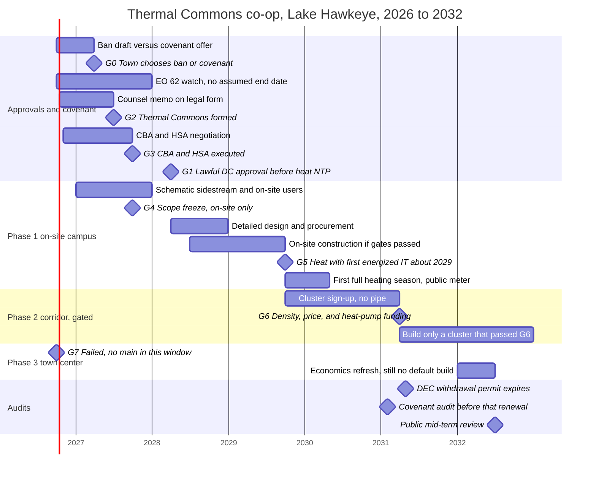

# Implementation timeline 2026–2032 — Thermal Commons

Team: Harsh Agarwal, Linson Lee, Philip Matchev.
Proposal: Thermal Commons co-op. Site: Lake Hawkeye / TeraWulf at the former Cayuga coal plant, Lansing, NY (Site 2). Comparison site: 111 8th Avenue, New York City (Site 1), not scheduled here.

This is a **condition-of-approval schedule**, not a construction forecast. The only hard external dates are TeraWulf’s statement that operations are not contemplated until approximately 2029, and the DEC water-withdrawal permit expiry of 30 April 2031. Every other bar below is a working calendar (**ASSUMPTION**) sized so the on-site heat campus can be ready when the first computing load is energized, and so that pipe which fails its gate is not built.

Base case in the model: **150 MW** IT, load factor 0.8, capture fraction 0.75, about **777.6 GWh/yr** heat available (average about **88.8 MW**). Phases 1–2 together deliver **50,576 MWh/yr**, **6.5%** of that supply. A 300–400 MW build-out (TeraWulf: about **400 MW gross / 320 MW critical IT**) does not resize Phase 1: the same delivered heat is about **3.0%** of a 320 MW case. Demand is the constraint. Source: `web/public/data/site2.json` (`supply`, `totals`, `extras.scenarios.dc_320MW_full_build`), generated 2026-10-04. Capacity statements: TeraWulf Q2 2026 earnings release, 5 August 2026, https://www.sec.gov/Archives/edgar/data/1083301/000108330126000162/a_wulfearningsreleaseq22026.htm — “operations not currently contemplated until approximately 2029” (verified 2026-10-03, `research/verification.md` rows 3a, 3b). The project website’s “~150 MW phase 1 / three buildings” has no phase split in that filing; basis unstated (same rows). An August 2025 release that said 138 MW in the second half of 2026 is **stale** and is not used as a milestone (same URL family: https://investors.terawulf.com/news-events/press-releases/detail/113/terawulf-secures-long-term-ground-lease-at-cayuga-site-to-expand-high-performance-computing-infrastructure, verified 2026-10-03).

## How to read this timeline

Three rings, three different decisions:

| Ring | What it is | Model result that sets the schedule | Decision |
| --- | --- | --- | --- |
| Phase 1, on-site | Greenhouse, aquaculture, recreation (pool). Food processing is in the concept and is not a separate model load. | 37,076 MWh/yr, peak 16.36 MW, 0.3 mi pipe, supply 113 °F, direct exchange, LCOH **$40.6/MWh** at 7% | **Build**, aligned to first energized IT around 2029, only after the covenant gates |
| Phase 2, corridor | Ambient loop toward homes and nearby farms | 500 homes, 13,500 MWh/yr, peak 6.84 MW, **13.0 mi**, linear density **0.20 MWh per foot per year**, LCOH **$285.8/MWh** | **Do not trench the 13.0 mi loop.** Sign-up clusters only, and only if a later gate passes |
| Phase 3, town center | School campus, town hall, library (and, in the model, Woodsedge senior apartments) | 3,577 MWh/yr, peak 2.96 MW, **8.7 mi**, LCOH **$734.2/MWh**, `passes_gate: false`. Pipe is **82%** of that ring’s capital cost. Pipe loss 1,840 MWh/yr | **No construction in 2026–2032.** Re-test in 2032 only |

Ring figures: `web/public/data/site2.json` → `rings`, generated 2026-10-04. Town-ring verdict text in the same file (`extras.with_town.verdict`): the long main makes town-center heat dearer than propane. Propane reference in the same file: **$136.1/MWh** (`finance.incumbent_usd_mwh.propane`). Blended Phases 1–2 at a 7% utility discount rate: **$106.1/MWh**, under propane; the blend is not permission to build the corridor by itself.

HDR lenses this schedule is built to serve: Community (a covenant people can enforce, and heat for a town that has lived with a gas moratorium), Ecology (air and carbon only where combustion is actually displaced; water as a promise not to use the lake permit for cooling; nutrients only if closed-loop aquaculture is built on site), Health (a recreation load on site in Phase 1; household combustion displacement only if a corridor cluster later connects). The Lake Hawkeye site pack states there are **no designated disadvantaged communities nearby** (`resources/text/2026_10_01_Hackathon_NYU_-_Suburban_Site_-_Lake_Hawkeye.txt`, page 24). This timeline does not create an environmental-justice set-aside.

## Where the calendar actually starts (facts, late 2026)

The Town Board has not voted a ban. On **29 September 2026** it directed its attorney to draft a local law prohibiting data centers. That is a drafting direction, not an enacted law. https://www.fingerlakes1.com/2026/10/02/lansing-moves-toward-data-center-ban-as-terawulf-debate-reaches-turning-point/ and https://607newsnow.com/news/258852-town-of-lansing-moving-forward-with-drafting-a-data-center-ban/ (verified 2026-10-03, `research/verification.md` row 1a). 607 News Now attributes opposition at **36 of 38** speakers; that count is single-source and no verbatim quote was captured in verification (row 1b). The Ithaca Voice reports the board **setting aside $500,000 in next year’s budget** for legal costs, not an existing reserve: https://ithacavoice.org/2026/09/lansing-board-data-center-ban/ (verified 2026-10-03, row 1c).

Thermal Commons is the offer that can sit beside that draft: a recorded Community Benefit Agreement and Heat Supply Agreement, so any approval is conditional on heat reuse and community terms. It is not a sustainability brochure added after entitlement.

Other clocks already running, which this schedule does **not** treat as permission to build:

- **Executive Order 62** (14 July 2026) tells DEC to hold discretionary permits for new or expanded data centers of at least 50 MW that were not complete before that date, until the Department of Public Service submits a final Generic Environmental Impact Statement. There is **no fixed end date**. Whether Lake Hawkeye is covered is **[unverified]**. Local approvals are outside the order. https://www.governor.ny.gov/executive-order/no-62-establishing-temporary-moratorium-data-centers-new-york-while-state-develops (verified 2026-10-03, rows 2a, 2b). The Gantt shows a watch, not an end date.
- **Water withdrawal permit** ID 7-5032-00019/00024, holder **Cayuga Operating Company LLC** (the landlord, not the operating data-center tenant): up to **1,008,000 gallons per day** from Cayuga Lake, Article 15 Title 15, uses limited to system maintenance, sump pumping, and dust control. Effective **13 April 2026**, expires **30 April 2031**. https://dec.ny.gov/sites/default/files/2026-04/cayugaoperatingwwpermit.pdf (verified 2026-10-03, rows 5a–5c). Heat reuse does not retire this permit and is not a gallon-for-gallon lake saving. TeraWulf’s public cooling description is a sealed closed loop rejected by air-cooled dry coolers, with no draw from or discharge to the lake: https://lakehawkeyedata.com/closed-loop-cooling (developer claim, verified 2026-10-03, rows 4a, 4c). The schedule’s water action is a **covenant** (permit not used for process, evaporative, or mist cooling) plus a **2031 renewal audit**.
- **NYSEG gas moratorium** in the Town of Lansing: invoked in **2015** (not 2014), still described as being addressed in a 14 July 2025 gas-system update; whether it is still in force in 2026 is **[unverified]**. NYSEG plans gas demand response there starting **1 January 2027**. https://documents.dps.ny.gov/public/Common/ViewDoc.aspx?DocRefId=%7BE068C615-B8EE-4CB9-AF92-3153A49BE4E4%7D and https://documents.dps.ny.gov/public/Common/ViewDoc.aspx?DocRefId=%7B30700A98-0000-CE30-9B40-1D15BBA44B68%7D (verified 2026-10-03, rows 6a, 6c-update). This is why household heat matters. It is not a construction milestone.
- **Ground lease:** Lake Hawkeye LLC, about **183 acres**, **80-year** term, lessor Cayuga Operating Company LLC. https://www.sec.gov/Archives/edgar/data/1083301/000110465925078086/tm2523008d1_8k.htm (verified 2026-10-03, row 3c). A figure of roughly 250 unleased acres is **not** used: verification row 3d marks total-site acreage beyond the lease **[unverified]**. Phase 1 siting stays inside land the applicant already controls. Pad acreage for a greenhouse yard is **[unverified]** in this lane.
- **Do not copy Lansing, Michigan.** Deep Green’s 24 MW proposal with the Board of Water & Light (announced 5 November 2025, heat into a downtown hot-water system) was **withdrawn on 6 April 2026**. https://www.lbwl.com/community/newsroom/2025-11-05-deep-green-proposes-120-million-sustainable-data-center-investment and https://www.wkar.org/michigans-data-center-divide/2026-04-06/proposed-data-center-wont-move-forward-in-lansing-as-deep-green-withdraws (verified 2026-10-03, row 12). Lesson for Gate 0 only: a heat-reuse story can die in one rezoning season. It is not a schedule template and it is not this town.

## Decision gates

A later phase cannot start because an earlier bar on the Gantt has elapsed. Each gate is pass/fail.

| Gate | When (working calendar, ASSUMPTION unless noted) | Pass looks like | Fail looks like |
| --- | --- | --- | --- |
| **G0** Town choice | Target decision by **31 March 2027**. The September 2026 direction is only to draft. The vote date is **[unverified]**. | Board tables or narrows a ban and agrees to negotiate a binding covenant. Or an enacted law that allows a data center only with the covenant as a condition. | Ban enacted and final. **Stop.** No design spend, no co-op assets, no trench. Deep Green (Lansing, Michigan) is the precedent for stopping cleanly. |
| **G1** Lawful data-center entitlement | Before any heat-side notice to proceed. Working target **31 March 2028** only if G0 passed in 2027. Actual hearing calendar **[unverified]**. | Site approval the town recognizes as lawful, with the CBA/HSA attached as conditions. EO 62 status checked; this schedule does **not** assume the order blocks or clears the project. | Approval denied, or still in active dispute such that the town will not treat it as final. Heat capex waits. |
| **G2** Legal form of Thermal Commons | Counsel memo by **30 June 2027**; formation only after the memo. | A vehicle that can own pipe, sign the HSA, and bill members. See the legal-form note under co-op formation. Public name remains the Thermal Commons co-op. | No statutory path the town attorney will sign. Fall back to a town public entity as asset owner, co-op as member association — or stop. |
| **G3** Executed CBA and HSA | Before detailed design procurement. Working target **30 September 2027**. | Recorded against the ground lease. Parties include Lake Hawkeye LLC **and** Cayuga Operating Company LLC (permit holder). Initial term **10 years** plus renewals, because data centers often will not guarantee heat beyond about 10 years (DATA HEAT Appendix A, p. 34, organizer extract `resources/text/DATA_HEAT_-_Sector_Couling_Data_Centeres_and_District_Energy_-_Market_Development_Guide_and_Appendicies_-_3MAR26.txt`). Cooling always wins: sidestream only, fail-safe to dry coolers. Water covenant as above. Step-in and a decommissioning reserve if the computing use ends. 24 months’ notice of cessation (**PROPOSAL** term, `docs/ownership-deal.md`; notice length is a proposal, not a statute). | Term sheet only. No construction. |
| **G4** Phase 1 scope freeze | With G3. | Users who come to the heat, on the industrial parcel: greenhouse, aquaculture, food processing if a tenant is signed, community recreation/pool. Interface is a plate heat exchanger in parallel with dry coolers. On-site LCOH **$40.6/MWh** at 7% versus propane **$136.1/MWh**. Model on-site loads: greenhouse 31,416 MWh/yr, aquaculture 4,500 MWh/yr, recreation 1,160 MWh/yr (`web/public/data/offtakers.json`). Distances in that file: 0.10–0.16 mi. | Any scope that adds the 8.7 mi town main “while we are digging anyway.” Reject. |
| **G5** Heat coincides with computing | TeraWulf date: operations approximately **2029** (earnings release above). Working milestone: beneficial heat in the **second half of 2029**, tied to the first energized block, not to 150 MW or 400 MW nameplate. | Minimum **availability** schedule in the HSA (temperature and hours), not a take-or-pay on heat the data center cannot export. Backup boilers and storage sit on the co-op side. Model: backup about **373 MWh/yr**, **0 unmet hours**, storage **1.47 million gallons** for Phases 1–2 (`site2.json` `totals`). Unmet hours of zero reflect backup sized to peak; they are not evidence the data center never trips (**ASSUMPTION** reading of the model, consistent with `docs/audit/code-review-pr2.md` on boiler sizing). | Data center slips past 2029: greenhouse and pool **slip with it**. Do not commission a heat user with no source. Data center is early: interface must already be in the cooling design. TeraWulf’s design-lock date is **[unverified]**. |
| **G6** Corridor clusters | No earlier than the first full heating season of Phase 1 (working window **winter 2029–30**), and a formal go/no-go by **31 March 2031**. | A signed cluster whose linear density clears the project screen of about **0.46 MWh per foot per year** (PLAN.md §1.2; this is our screen, not a code minimum) **and** whose levelized cost is at or below propane ($136.1/MWh) **and** whose building heat pumps are funded. The modeled 13.0 mi / 500-home loop fails the first two tests (0.20 MWh/ft/yr and $285.8/MWh). Model finding: paying for pipe alone does not bring tariffs to 0.8× propane; building heat pumps (about $16,000 each in the model note) must be funded too (`site2.json` `extras.cba.breakeven_homes_if_cba_pays_pipe.finding`). | Full corridor. It stays unbuilt through 2032. |
| **G7** Town-center main | **Failed on current numbers.** Refresh only in **2027** (does not unlock construction) and again by **30 June 2032**. | A new study in which this ring’s LCOH is at or below propane, or an external grant covers the pipe **and** a real anchor is contracted. The model’s aside about Cargill is not that anchor: `offtakers.json` labels “Cargill Cayuga Salt Mine” load **unverified**, distance **7.4 mi**, ring `none`. | Default through 2032: **no main.** |

**Why G7 fails in distance as well as in dollars.** The model places Lansing Central School District campus at **6.6 mi**, Lansing Town Hall at **8.1 mi**, and Lansing Community Library at **8.1 mi** (geocoded model distances; 10.58, 13.01 and 13.05 km in the model file). The working brief’s “roughly 5–7 miles” is the same problem at the same order of magnitude; hall and library in the model sit a bit farther. CBS’s connection screen lists **>1.2 mi** in the poor distance band (Figure 9, `resources/text/CBS_Data_center_white_paper_DISTRICT_HEATING.txt`). On-site users at 0.10–0.16 mi are the loads that match that screen. Woodsedge senior apartments are in the town ring at **8.2 mi** and are modeled on gas, not as a 2029 connection. Seniors are not promised a pipe in this window. Equity claim stays with propane and oil households who might later join a cluster, and with the on-site recreation load, not with a disadvantaged-community designation the site pack says is absent.

**Capital the gates are protecting.** Phases 1–2 capital in the model: **$38.76 million** (of which corridor pipe **$9.39 million** and 500 building heat pumps **$8.0 million** are the pieces G6 can refuse). Adding the town ring raises capital to **$64.34 million**. Whole-project funding gap at 7% so that tariffs stay under incumbents: **$26.01 million** NPV. The corridor ring’s own gap is **$30.32 million**; the on-site ring’s surplus is why the whole-project gap is smaller. Both figures are model outputs (`finance.capex_musd`, `extras.cba`, `extras.funding`). They are not bids. A community-benefit cash contribution is sometimes compared with an assumed data-center capital cost of **$10 million per MW × 150 MW = $1.5 billion** (midpoint of Turner & Townsend’s 2025 US range of $6.6–13.3 per watt: https://reports.turnerandtownsend.com/data-centre-construction-cost-index-2025/). On that **ASSUMPTION**, the whole-project gap is about **1.7%** of data-center capital and the corridor gap about **2.0%** (`extras.cba`). The percentage is a talking scale, not a negotiated payment.

Federal geothermal ITC is **not** on the critical path. Waste-heat pipe is not treated as geothermal heat-pump property; the model’s base case takes no credit (`research/verification.md` rows 9d-i and 9h, and `site2.json` sources `ver_itc`). If counsel later finds that a ground-source package qualifies, construction must **begin before 1 January 2033** to keep the 30% prevailing-wage rate; 2033 and 2034 starts step down, and nothing remains for starts in 2035 (26 U.S.C. §48, https://www.law.cornell.edu/uscode/text/26/48, verified 2026-10-03, row 9b). A 2028 Phase 1 start, if any of it qualified, would sit inside the 30% window. That is upside, not the schedule’s reason for being. A heat co-op is **not** automatically an “applicable entity” for direct pay; municipalities and rural electric cooperatives are (https://www.law.cornell.edu/uscode/text/26/6417, verified 2026-10-03, row 9e). That is one reason G2 exists.

## Gantt

Dates other than “ops ~2029”, the 29 September 2026 board direction, the 13 April 2026 permit, and the 30 April 2031 permit expiry are **ASSUMPTION**. Logic: term sheets in 2027 while the ban is still a draft; no heat construction before G0–G3; on-site works in 2028–29 only if those gates pass; corridor and town center stay off the 2029 critical path.

## Year by year

### 2026 (fourth quarter) — politics before design

- Publish the covenant outline to the Town Board while the ban is still a draft: heat interface, on-site campus, water covenant, public BTU meter, 10-year heat term with step-in, cooling reliability untouched.
- Open counsel on legal form (G2). Do not incorporate on a guess.
- Ask TeraWulf / Lake Hawkeye LLC for the cooling-plant design schedule. That date is **[unverified]** and it controls whether 2027 schematic work is early or late.
- EO 62: log whether any DEC application for this project was complete before 14 July 2026. Today that fact is **[unverified]**. Do not tell the town the order saves or kills the project.
- No site work.

### 2027 — co-op, contracts, schematic only

**Co-op formation (G2).** The public vehicle is the Thermal Commons co-op: members are the on-site users and, later, any household that actually connects. The legal wrapper is an open question, and the schedule spends the first half of 2027 on it rather than on pipe.

- Town Law §190’s district list (sewer, water, lighting, and so on) does not name a heating district. Whether a town improvement district can be used is **unconfirmed and likely no** without special legislation. https://www.nysenate.gov/legislation/laws/TWN/190 (verified 2026-10-03, `research/verification.md` row 11d).
- Public Service Law §66-t lets gas and electric corporations develop thermal networks and tells the PSC to exempt small-scale networks **not** owned by utilities. It does not itself create a municipal thermal utility. https://www.nysenate.gov/legislation/laws/PBS/66-T (verified 2026-10-03, row 11a).
- A nonprofit cooperative carve-out exists in the steam definition where steam is produced solely for members. Whether hot-water service fits that carve-out is **[unverified]** (row 11c). https://www.nysenate.gov/legislation/laws/PBS/2
- A municipality selling **steam** to non-municipal customers needs a PSC certificate (PSL §81). Whether that section reaches hot water is **unconfirmed**. Serving only municipal buildings would sit outside §81. https://www.nysenate.gov/legislation/laws/PBS/81 (verified 2026-10-03, row 11b).
- **PROPOSAL, pending that memo:** town or a town-created public entity holds title (so direct pay is even possible if any credit applies); Thermal Commons co-op is the member-facing operator under a concession-style operating contract. If counsel says a pure co-op can sign and the town attorney agrees, use that. Do not wait for a NYSEG utility thermal pilot to be the 2029 owner. The Ithaca pilot (one city block, not Lansing) was still not in Stage 3 as of the report dated 28 February 2026: Stage 1 filed 15 December 2023, Staff cleared Stage 2 on 9 April 2024, Stage 2 filed 9 July 2025. https://documents.dps.ny.gov/public/Common/ViewDoc.aspx?DocRefId=%7BD0C5F097-0000-CD58-8606-053FB4284E6A%7D and the March 2026 status report cited in verification row 8-status (verified 2026-10-03). A utility path is a multi-year stage gate. It cannot be how this town gets heat in 2029.

**CBA / HSA (G3), negotiated in parallel with G0.** Exhibits, not slogans:

- Sidestream heat exchanger, isolation, fail-safe to dry coolers. Data-center cooling never depends on the greenhouse, the fish tanks, or the pool.
- Water covenant signed by **Cayuga Operating Company LLC**, because that company holds the withdrawal permit (verification rows 5a, 3c).
- 10-year initial term from commercial operation of the heat interface, then renewal, with 24 months’ notice and a funded wind-down (**PROPOSAL** on the notice and the reserve formula; the 10-year ceiling is the DATA HEAT finding above). A term signed in 2027 and counted from 2029 operations would run to about **2039**, so 2032 is a mid-term review, not an expiry.
- Heat price at the fence near zero; the co-op pays metered incremental pumping and exchanger maintenance it causes (**PROPOSAL**). On-site users still see a delivered cost; the model’s grower comparison is about **$50/MWh** against propane at **$136/MWh** (`site2.json` `value_by_stakeholder`). That $50 figure is a model tariff illustration, not a signed rate.
- Public annual statement: heat delivered, supply temperature, hours curtailed, backup fuel, jobs on the campus, and whether any of the 1.008 MGD was used for cooling (the allowed answer under the covenant is no).

**Design.** Schematic only: exchanger capacity matched to Phase 1 peak (**16.36 MW** in the model, not to 88.8 MW average available heat), 0.3 mi on-site distribution, customer substations, co-op-side backup and storage. Food processing stays in the program if a packhouse tenant signs; it has **no MWh line** in `site2.json` or `offtakers.json` (**gap**). Do not enlarge pipe for an unsigned user.

**ASSUMPTION on 2027 being “paper year”:** the political gate is still open, EO 62 has no end date, and the cooling-plant lock date is unknown. Spending construction dollars in 2027 would bet the co-op’s money ahead of G0.

### 2028 — notice to proceed only if G0, G1, and G3 are yes

- Detailed design, bids, and procurement of the exchanger skid and on-site pipe.
- Greenhouse, aquaculture, and pool sponsors sign heat-purchase contracts with the co-op **before** their own foundations, so backup heat is their obligation when the data center curtails.
- If G1 is still open at mid-year, slide construction into 2029 and keep the 2029 heat date only if TeraWulf’s own operations also slide. Do not build a campus for a data center that does not have a lawful approval.
- Corridor: start a **sign-up book** only (no options on trench). Tell households the price test in plain language: blended Phases 1–2 can be priced at about **$108.9/MWh** (model tariff, 20% under the $136.1 propane figure: 0.8 × 136.1 = 108.9) and about **$735/yr** versus propane for a **27 MWh** home (`site2.json` `finance.household`). Also tell them the corridor **alone** is $286/MWh and will not be built as a 13.0 mi loop. Low-income tier in the model is **$88.5/MWh**. That tier is a tariff design for connectors, not a finding that the tract is a disadvantaged community.
- NYSEG’s planned Lansing gas demand response starts **1 January 2027** (verification row 6c-update). 2028 is when to ask whether Non-Pipes Alternatives or NYSERDA Clean Heat can fund **building** heat pumps for a future cluster. Lansing’s NPA portfolio was five projects totaling **$9.0 million**, confirmed as of the Q1 2024 report, not a blank check for this loop. https://documents.dps.ny.gov/public/Common/ViewDoc.aspx?DocRefId=%7BC09A5D8F-0000-CE32-81A0-BA75B7347FC2%7D (verified 2026-10-03, row 6d).

### 2029 — Phase 1 in service with the data center, not before it

TeraWulf: operations not contemplated until approximately 2029 (SEC release cited above). **ASSUMPTION:** beneficial heat in the second half of 2029, because the earnings line says “approximately,” not a month.

What “in service” means:

- Dry coolers still reject 100% of design heat if the co-op takes nothing. Developer cooling description: https://lakehawkeyedata.com/closed-loop-cooling (verified 2026-10-03).
- Co-op meter at the interface reads flow and temperature from day one.
- On-site users commissioned against the **energized** block. The HSA minimum is availability, scaled to megawatts actually online, not to the 400 MW gross figure.
- Summer will not be saved by the greenhouse. Data-center heat is comparatively flat; greenhouse demand peaks in winter. That seasonal pattern is why the model’s monthly demand falls from **8,954 MWh** in January to **735 MWh** in July, while monthly supply stays between **58,138 MWh** (April) and **66,960 MWh** (several summer and winter months) (`site2.json` `monthly`). Dry coolers remain the summer rejection path. Scheduling extra summer load (aquaculture holding temperature, a pool, a packhouse) is the mitigation; claiming the lake as a summer heat sink is not. The permit does not allow that use (verification row 5c).

Phase 2 pipe does not break ground in 2029.

### 2030 — measure, then decide whether any home is real

- Publish the first heating season: delivered MWh, hours on backup, temperature at the greenhouse and the pool, curtailments, and the water-covenant audit (zero gallons of the 1.008 MGD used for cooling).
- Compare on-site LCOH outcome with the $40.6/MWh model. If the campus cannot take heat or the data center did not energize, **G6 does not open.**
- Corridor remains a subscription list. Density math the list must beat (**ASSUMPTION** from model inputs, not a new survey): 0.46 MWh per foot per year ÷ 27 MWh per home ≈ **90 homes per mile**. Five hundred homes at that density would be about **5.6 mi** of pipe, not 13.0 mi, and they would still need the heat-pump funding test. Scattered sign-ups along 13.0 mi fail even if the count hits 500.

### 2031 — permit renewal, and the only year a cluster could start

- **By 31 January 2031:** covenant audit, before the withdrawal permit expires **30 April 2031**. The ask at renewal is the same limited uses (maintenance, sump pumping, dust control), not a cooling withdrawal. Tompkins County Resolution 2026-3 (20 January 2026) already asked DEC for a new, project-appropriate review of an earlier modification application; that was not the same application DEC renewed. https://tompkinscountyny.iqm2.com/Citizens/Detail_LegiFile.aspx?ID=13804&MeetingID=4213 (verified 2026-10-03, rows 5d, 5f). The 2031 renewal is a public moment. Thermal Commons shows up with meter data, not with a claim that heat reuse saved the lake.
- **31 March 2031, G6.** If no cluster passes density, price, and heat-pump funding, the corridor bar ends. The $9.39 million pipe and $8.0 million of building heat pumps stay unspent.
- If one cluster passes, construction of **that cluster only** can run 2031–2032. It is not on the data center’s critical path and it does not hold Phase 1 hostage.

### 2032 — mid-term review; town main still closed

- **By 30 June 2032:** public review. Heat delivered versus the HSA availability promise, tariff versus propane and oil, campus employment the town can check, nutrient and stormwater practice on the greenhouse pad, and whether G6 built anything.
- Re-run G7 with updated pipe costs and any new anchor. Default remains no 8.7 mi main. School annual load in the model is **2,057 MWh**, town hall **140 MWh**, library **180 MWh** (`offtakers.json`). Those loads do not pay for 8.7 mi.
- If any ground-source package was found eligible for the ITC, **begin-construction** evidence must be in hand before **1 January 2033** (verification row 9b). Phase 1, if built in 2028–29, would already have started. This deadline matters only for a later qualifying add-on. It is not a reason to start the town main.
- Build-out toward ~400 MW gross, if TeraWulf proceeds, does not automatically open Phase 3. The model’s 320 MW case still delivers the same ~50.6 GWh to the same users. New offtakers still walk through G6 and G7.

## What is deliberately not scheduled

- A town-center transmission main, a library connection, a town-hall connection, or Woodsedge, in 2026–2032.
- The full 13.0 mi ambient loop.
- Any use of Cayuga Lake as the heat sink, or any claim that Phase 1 saves 1.008 MGD.
- Dependence on Executive Order 62 ending.
- A NYSEG UTEN pilot as the owner of Phase 1 (the Ithaca stage times above are the evidence).
- Federal ITC as base-case funding.
- Copying Deep Green’s Lansing, **Michigan** project into this town’s calendar.
- Site 1 (111 8th Avenue). That building is a commissioned carrier hotel. Its heat reuse, if any, would be a retrofit into an operating cooling plant with existing tenants. Site 2 is the proposal because the computing plant is still ahead (operations approximately 2029), so the sidestream can be a design condition rather than a later cut-in, and because the town is deciding now whether a project is acceptable at all.

## HDR and Grundfos — what each year is for

| Domain | When it becomes real | What the schedule owes the judges |
| --- | --- | --- |
| Community | 2026–27 covenant; 2029 campus; homes only after G6 | Binding CBA/HSA, co-op the town can see, public meter. Not a green add-on after a ban fight. |
| Human health | 2029 recreation/pool on site; household combustion only if a cluster connects | Do not count 500 homes of cleaner indoor air in 2029. Those homes are still a gate. |
| Air and carbon | Same split | Model headline **12,575 short tons CO₂/yr** avoided (`site2.json` `impact`) is Phases 1–2 fully built, including corridor fossil displacement of about **52,016 MWh/yr**. Until G6 passes, cite Phase 1 only, and Phase 1’s share of that short-ton figure is **not broken out** in the JSON (**gap**). |
| Water | Covenant at signing; audit January 2031 | Grundfos question is scarcity and withdrawals. Answer on this site: dry coolers stay; the renewal stays limited to maintenance, sump pumping, and dust control; **no gallons claimed as saved by heat reuse.** |
| Biodiversity | Phase 1 pad location | Stay on already industrial ground inside the 183-acre lease. The site pack’s biodiversity sheet names agriculture as the greatest threat in the wider landscape (page 12 of the Lake Hawkeye extract). A greenhouse here is a heat user on a former plant, not a claim that the project restores the lake shore. |
| Nutrients | Only if aquaculture is closed-loop and built | Site pack: Cayuga Lake is impaired for phosphorus, and some site runoff reaches the lake (pages 18–19 of the same extract). The schedule does not promise a nutrient credit. It refuses a once-through discharge as the way to “use” heat. |
| Ecology, general | Every gate | Supply is ~777.6 GWh available and ~50.6 GWh delivered in the base build. Most heat still goes to fans. Say that in every annual report. |

## Critical path

**G0 → G2 legal form → G3 CBA/HSA → G1 lawful approval → exchanger in the cooling design → Phase 1 heat when the first IT block is energized around 2029.**

Phase 2 and Phase 3 are options with failed or unproven economics. They are drawn on the Gantt so a judge can see they were tested and refused, not forgotten.

## Lane status

**Done**

- Implementation window 2026–2032 written against the verified political start (29 September 2026 draft-ban direction), TeraWulf’s ~2029 operations statement, and the 30 April 2031 withdrawal-permit expiry.
- Mermaid Gantt with approvals, CBA/HSA, Thermal Commons formation, design, and Phase 1 / 2 / 3.
- Decision gates G0–G7, including an explicit fail on the town-center main (LCOH $734.2/MWh, 8.7 mi, `passes_gate: false`) and a fail on the full corridor (0.20 MWh/ft/yr and $285.8/MWh versus a 0.46 MWh/ft screen and propane at $136.1/MWh).
- Phase 1 aligned to data-center operations approximately 2029, sized to the on-site peak (16.36 MW), not to 150 MW or 400 MW nameplate.
- Water kept as a covenant plus a 2031 renewal audit. No 1:1 lake-water claim.
- Legal-form risks for a co-op pulled from verification (Town Law §190, PSL §66-t, §81, §2) instead of assuming incorporation is straightforward.
- Lansing, Michigan (Deep Green) kept out of this town’s dates.
- Equity not overclaimed: site pack, no designated disadvantaged communities nearby.

**Missing**

- TeraWulf’s cooling-plant design-lock date and a month-level operations date inside “approximately 2029”.
- Whether any DEC application was complete before 14 July 2026 (EO 62 coverage).
- The Town Board’s vote date on a ban, and whether “next year’s” $500,000 legal line is actually appropriated.
- A surveyed pad for the greenhouse / aquaculture / pool inside the 183-acre lease. Broader “unleased acreage” is unverified.
- Food-processing load (named in the concept, absent from `site2.json` and `offtakers.json`).
- Phase 1-only CO₂, separate from the 12,575 short tons/yr figure that includes the corridor.
- A counsel memo resolving co-op versus town ownership (G2). This file schedules the memo; it does not replace it.
- 2026 status of the NYSEG gas moratorium (confirmed in the record through the 14 July 2025 filing only).
- Article 78 or other litigation status. Not used here, because it is not confirmed in `research/verification.md`.
- Bid-level capital costs. All dollar figures are model outputs or stated assumptions.

**Open questions**

- If the ban is enacted with no covenant exception, does the team stop in public, or keep a shelf design? This schedule stops.
- Should the 10-year HSA term start at signing (about 2027) or at heat commercial operation (about 2029)? Renewal politics in 2032 change with that choice. **ASSUMPTION here:** term runs from heat commercial operation.
- Can building heat pumps for a future cluster be funded from the existing Lansing NPA portfolio, or does that $9.0 million program have no remaining room? Not re-checked in this lane beyond the Q1 2024 verification row.
- Does Woodsedge (senior housing, 8.2 mi, modeled on gas) ever deserve its own exception to G7, or is on-site recreation the honest near-term offer to older residents? This schedule chooses the recreation offer and leaves Woodsedge behind G7.
- Model inconsistency to reconcile before anyone prints a peak: corridor peak is **6.84 MW** on the ring and **7.5 MW** on the offtaker row. Gates above use the ring figure because the phase LCOH sits on the ring.
